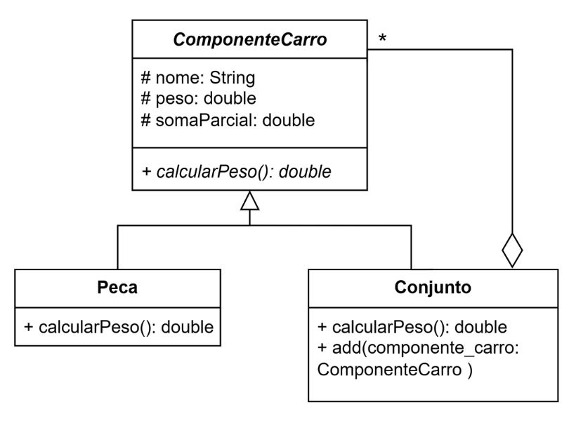
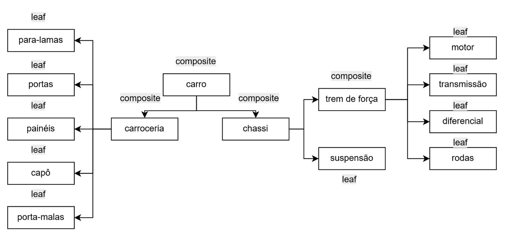

# Questão 05 - Lista de Padrões de Projeto OO
**Alunos:** Maria Letícia de Sousa Barboza e Caio Vinícius de Santana Gomes

Este repositório contém a solução para a lista de exercícios de Padrões de Projeto Orientados a Objetos, demonstrando a aplicação do padrão **Composite**.

## 📖 O Problema
O desafio consiste em modelar um sistema para calcular o peso total de um carro, que é composto por uma estrutura hierárquica de partes (como chassi, carroceria e trem de força) e subpartes indivisíveis (motor, portas, suspensão, etc.). A estrutura deve permitir tratar tanto as peças individuais quanto os grandes conjuntos de peças de maneira uniforme, contabilizando o peso total e imprimindo as somas parciais na tela a cada etapa do cálculo.

## 🏗️ Modelagem da Solução

O projeto foi estruturado utilizando o padrão Composite, composto pela definição de classes e pelo rascunho da árvore de objetos.

### 1. Diagrama de Classes UML


O mapeamento arquitetural segue a seguinte estrutura:
- **Component (`ComponenteCarro`):** A classe base abstrata para todos os elementos estruturais. Define os atributos protegidos `# nome`, `# peso` e a variável de rastreio `# somaParcial`.
- **Leaf (`Peca`):** Representa as partes indivisíveis do veículo. Ela implementa o método `calcularPeso()` para contabilizar o próprio valor.
- **Composite (`Conjunto`):** Representa os agrupamentos de peças. Contém o método `add(item: ComponenteCarro)`, permitindo que o conjunto armazene tanto peças soltas quanto outros conjuntos inteiros.

### 2. Hierarquia de Objetos (Árvore de Implementação)


A instanciação do sistema segue rigorosamente a árvore acima, dividindo os nós entre agregadores e elementos finais:
- **Nós Composite (Agregadores):** O nó raiz é o `carro`, que engloba a `carroceria` e o `chassi`. O `chassi`, por sua vez, engloba o `trem de força`.
- **Nós Leaf (Folhas):**
    - A carroceria contém `para-lamas`, `portas`, `painéis`, `capô` e `porta-malas`.
    - O chassi contém diretamente a `suspensão`.
    - O trem de força contém o `motor`, a `transmissão`, o `diferencial` e as `rodas`.

## 🚀 Como Executar

O projeto é simples e não requer gerenciadores de dependência externos. Para compilar e rodar a simulação via terminal:

1. Navegue até o diretório onde as classes foram criadas.
2. Compile os arquivos:
   ```bash
   javac *.java